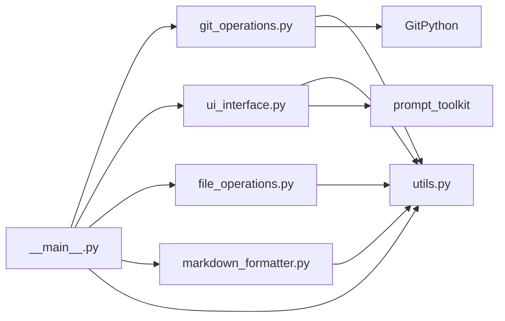

# Referencia de Módulos - Changelogger

## Estructura del Proyecto

```
src/changelogger/
├── __init__.py           # Definición de versión del paquete
├── __main__.py          # Punto de entrada principal (93 líneas)
├── utils.py             # Utilidades generales (67 líneas)
├── git_operations.py    # Operaciones Git (95 líneas)
├── ui_interface.py      # Interfaz de usuario TUI (108 líneas)
├── file_operations.py  # Operaciones de archivos (67 líneas)
└── markdown_formatter.py # Formato Markdown (58 líneas)
```

## Módulos y Responsabilidades

### `__main__.py` - Punto de Entrada
**Propósito:** Orquestar el flujo principal de la aplicación
**Líneas:** 93 (reducido de 501)
**Responsabilidades:**
- Coordinación entre módulos
- Flujo de trabajo principal
- Manejo de errores a nivel de aplicación

**Funciones principales:**
- `main()` - Punto de entrada principal

**Dependencias:**
- `file_operations` - Operaciones de archivos
- `git_operations` - Operaciones Git
- `markdown_formatter` - Formato Markdown
- `ui_interface` - Interfaz de usuario
- `utils` - Utilidades

### `utils.py` - Utilidades Generales
**Propósito:** Funciones reutilizables y de bajo nivel
**Líneas:** 67
**Responsabilidades:**
- Validación de dependencias
- Formato de texto y fechas
- Utilidades de sistema
- Funciones de ayuda

**Funciones principales:**
- `ensure_gitpython()` - Verificar dependencia GitPython
- `print_title()` - Formato de títulos para consola
- `format_timestamp()` - Formato de timestamps
- `slugify()` - Conversión a slug para nombres de archivo
- `get_numeric_input()` - Validación de input numérico
- `is_tty_available()` - Verificar disponibilidad de TTY
- `ensure_directory_exists()` - Creación segura de directorios
- `normalize_file_status()` - Normalización de estados Git

### `git_operations.py` - Operaciones Git
**Propósito:** Abstracción sobre GitPython para operaciones Git
**Líneas:** 95
**Responsabilidades:**
- Detección y validación de repositorios
- Obtención y análisis de commits
- Generación de diffs
- Clasificación de cambios

**Funciones principales:**
- `detect_repository()` - Detectar repositorio Git actual
- `list_recent_commits()` - Obtener commits recientes
- `analyze_commit_changes()` - Analizar archivos de un commit
- `classify_files_by_status()` - Clasificar archivos por estado
- `get_commits_in_range()` - Obtener commits en un rango
- `generate_diff()` - Generar diff entre commits
- `get_commit_short_hash()` - Obtener hash corto
- `format_commit_info()` - Formatear información de commit

### `ui_interface.py` - Interfaz de Usuario
**Propósito:** Manejar toda interacción con el usuario
**Líneas:** 108
**Responsabilidades:**
- Diálogos TUI modernos con prompt_toolkit
- Fallback a modo texto
- Validación de inputs
- Navegación y selección

**Funciones principales:**
- `select_commit_tui()` - Selección TUI de commits
- `select_commit_fallback()` - Selección modo texto
- `select_commit()` - Selector unificado (TUI + fallback)
- `confirm_action()` - Confirmación Sí/No con TUI

### `file_operations.py` - Operaciones de Archivos
**Propósito:** Manejo de archivos y directorios
**Líneas:** 67
**Responsabilidades:**
- Creación de estructura de directorios
- Generación de nombres de archivo
- Escritura de archivos con codificación UTF-8
- Gestión de rutas

**Funciones principales:**
- `ensure_output_structure()` - Crear estructura .changelogger
- `generate_filenames()` - Generar nombres de archivo
- `write_diff_file()` - Escribir archivo diff
- `write_markdown_file()` - Escribir archivo Markdown
- `get_repository_working_path()` - Obtener ruta del repositorio
- `create_output_files()` - Crear archivos de salida
- `print_output_summary()` - Imprimir resumen final

### `markdown_formatter.py` - Formato Markdown
**Propósito:** Generación y formato de contenido Markdown
**Líneas:** 58
**Responsabilidades:**
- Estructuración del changelog
- Formato de fechas y metadatos
- Plantillas de contenido
- Localización en español

**Funciones principales:**
- `format_file_list()` - Formatear lista de archivos
- `format_commit_section()` - Formatear sección de commit
- `format_changelog()` - Generar changelog completo
- `format_commit_selection_summary()` - Resumen de selección

## Flujo de Datos Entre Módulos



## Mejoras de la Refactorización

### Antes de la Refactorización
- **Archivo único:** `__main__.py` con 501 líneas
- **Acoplamiento alto:** Todas las funciones en un solo lugar
- **Dificultad de testing:** Módulo monolítico
- **Código duplicado:** Funciones similares sin reutilización

### Después de la Refactorización
- **Módulos especializados:** 6 módulos con responsabilidades claras
- **Bajo acoplamiento:** Dependencias bien definidas
- **Alta testabilidad:** Cada módulo puede ser testeado independientemente
- **Reutilización:** Funciones compartidas en utils
- **Mantenibilidad:** Código más fácil de entender y modificar

### Métricas de Mejora
- **Reducción de líneas:** `__main__.py` de 501 → 93 líneas (81% reducción)
- **Número de módulos:** 1 → 6 módulos especializados
- **Cohesión:** Alta dentro de cada módulo
- **Acoplamiento:** Bajo entre módulos
- **Documentación:** Completa con docs técnicos

## Patrones de Diseño Aplicados

### 1. Single Responsibility Principle
Cada módulo tiene una única responsabilidad bien definida.

### 2. Dependency Inversion
Los módulos de alto nivel no dependen de los de bajo nivel.

### 3. Open/Closed Principle
El sistema está abierto para extensión pero cerrado para modificación.

### 4. Don't Repeat Yourself (DRY)
Funciones comunes centralizadas en `utils.py`.

## Testing Strategy

### Unit Tests por Módulo
- **utils.py:** Testing de funciones puras sin dependencias
- **git_operations.py:** Mock de GitPython
- **ui_interface.py:** Mock de prompt_toolkit y input
- **file_operations.py:** Mock de operaciones I/O
- **markdown_formatter.py:** Testing de formato de texto
- **__main__.py:** Integration testing del flujo completo

### Integration Tests
- Flujo completo con repositorios Git de prueba
- Interacción entre todos los módulos
- Manejo de errores y casos límite

## Extensibilidad Futura

### Nuevos Formatos de Salida
- Añadir nuevos formatters sin modificar código existente
- Plugin system para diferentes formatos (JSON, HTML, etc.)

### Nuevas Interfaces
- Web UI alternativa
- API REST
- Integración con IDEs

### Nuevos Análisis
- Métricas de commits
- Análisis de código
- Integración con servicios externos

## Performance Considerations

### Optimizaciones
- **Lazy loading:** Importaciones condicionales
- **Memory efficiency:** Liberación de recursos
- **I/O operations:** Operaciones atómicas donde es posible

### Monitoreo
- Tiempo de respuesta por operación
- Uso de memoria por módulo
- Escalabilidad con repositorios grandes

## Seguridad

### Validaciones
- Sanitización de rutas y nombres de archivo
- Validación de inputs del usuario
- Manejo seguro de excepciones

### Permisos
- Creación segura de directorios
- Operaciones sin privilegios elevados
- Encoding consistente (UTF-8)
